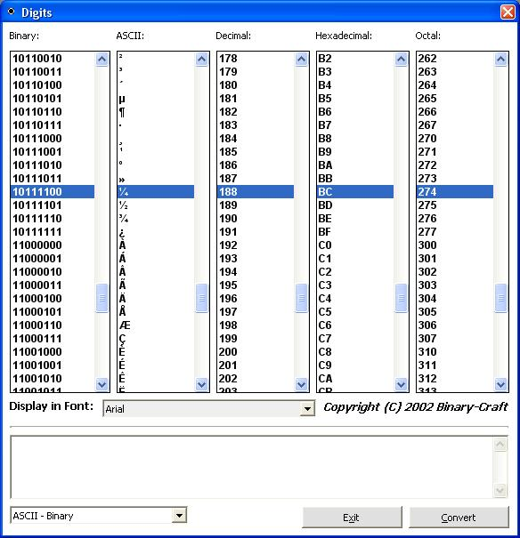



## BaseList

### Description

Lets you easily convert bin/dec/hex/oct to any other base by clicking on an item in the listbox. This will highlight the values in the other listboxes.
 
### More Info
 

             |
---                |---
**Submitted On**   |2002-09-02 12:09:42
**By**             |[TheMouse](https://github.com/Planet-Source-Code/PSCIndex/blob/master/ByAuthor/themouse.md)
**Level**          |Intermediate
**User Rating**    |5.0 (35 globes from 7 users)
**Compatibility**  |VB 6\.0
**Category**       |[Miscellaneous](https://github.com/Planet-Source-Code/PSCIndex/blob/master/ByCategory/miscellaneous__1-1.md)
**World**          |[Visual Basic](https://github.com/Planet-Source-Code/PSCIndex/blob/master/ByWorld/visual-basic.md)
**Archive File**   |[BaseList125655922002\.zip](https://github.com/Planet-Source-Code/themouse-baselist__1-38592/archive/master.zip)

